# SACMAIS Backend

>- Passo a passo de como subir a aplicação do backend.

>- Cada cliente terá uma configuração no railway, vercel e supabase.

---

## Plataformas utilizadas:

- [Vercel][vercel]
- [Railway][railway]
- [Supabase][supabase]

---

## Iniciando para um novo cliente

### 1. Criar uma nova organização no github

É preciso criar uma nova organização no github para que as plataformas realizem o deploy da aplicação e tudo fique bem separado. Uma vez que a organização foi criada, é nela que estrá presente o backend e o frontend.

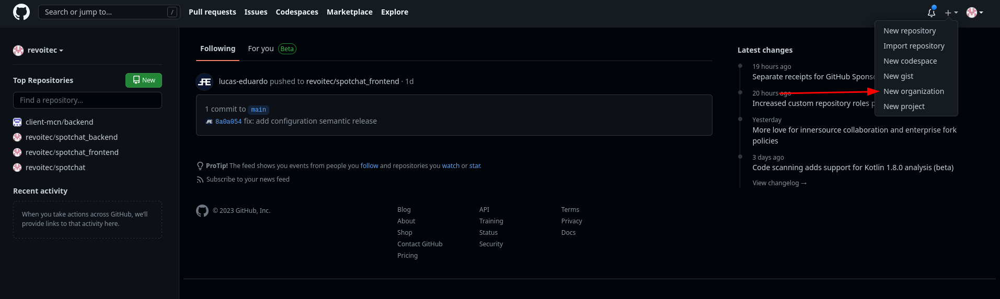
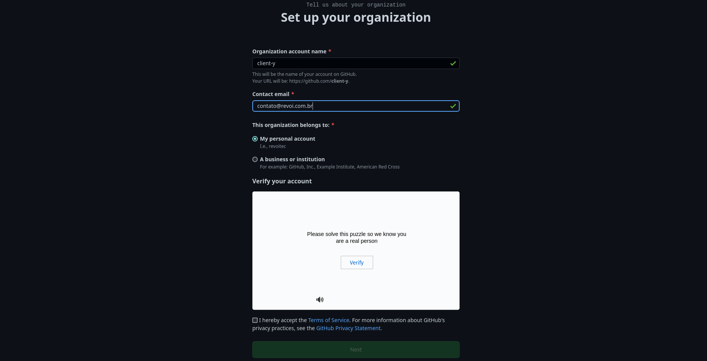

### 2. Criar o repositório do backend usando o repositório template

Ao usar o repositório template, o mesmo já virá tudo configurado.

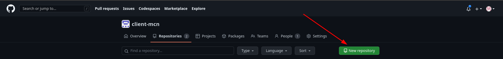
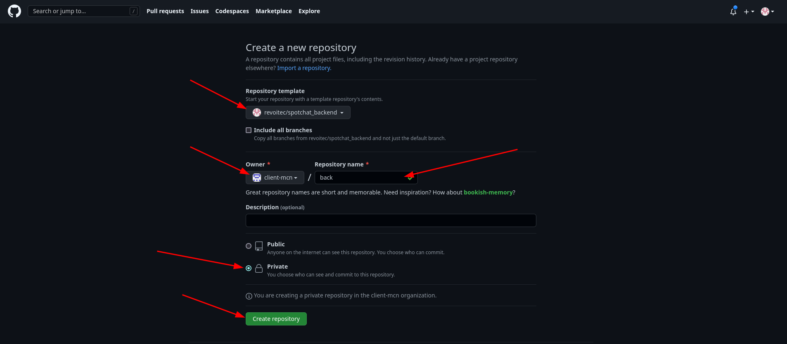

### 3. Criar o projeto no Railway

É necessário criaro projeto separado no railway, lembre-se de criar um projeto em branco.

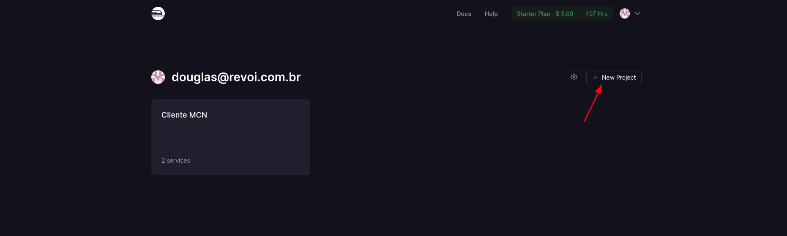
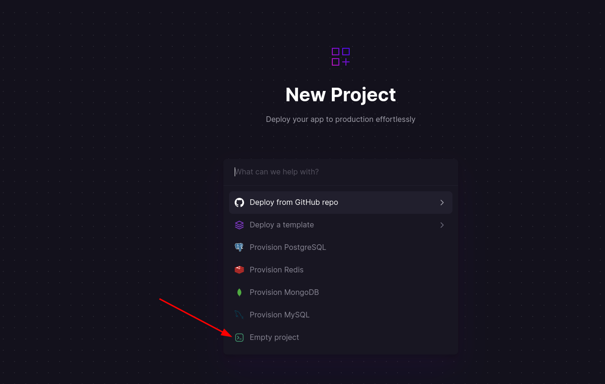

### 4. Criar o Redis

É necessário também fazer a criação do Redis no railway

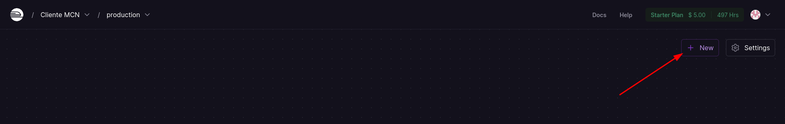
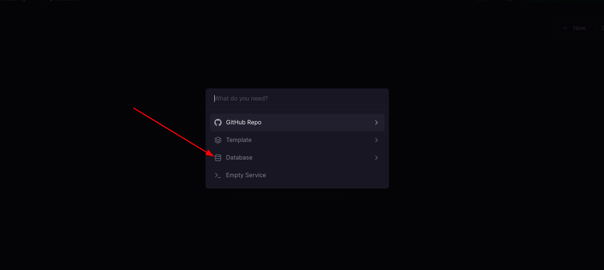
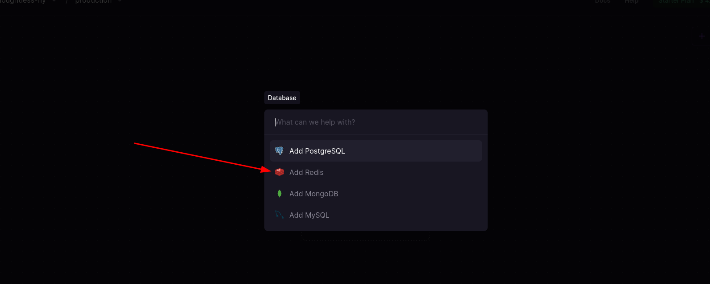

### 5. Configurar o Supabase

Criar um banco de dados para o cliente

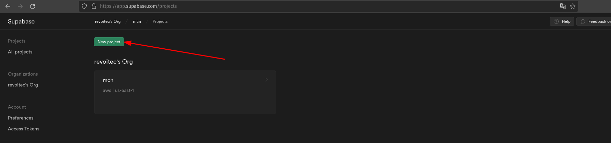
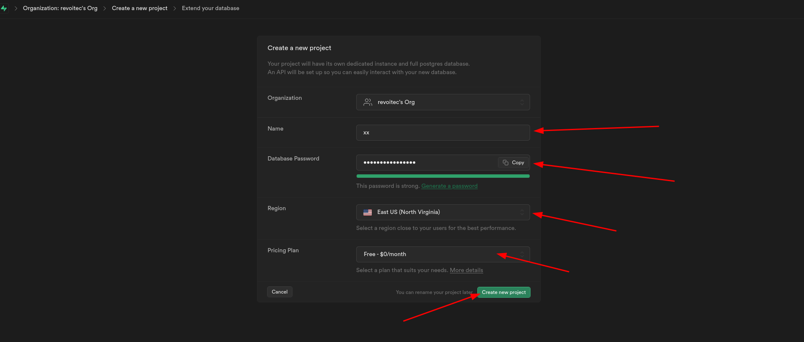

Depois de criado, basta pegar as informações para a conexão

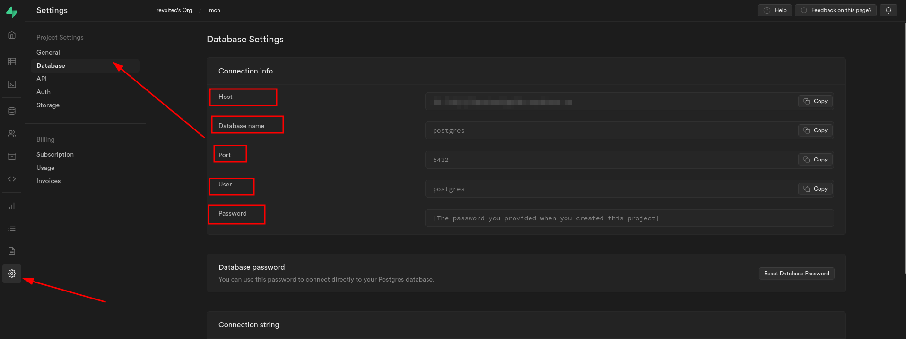

### 6. Configurar o backend no railway

Agora basta entrar no projeto vazio e fazer algumas configurações:

  1. Configurar o nome e a geração do dominio:
    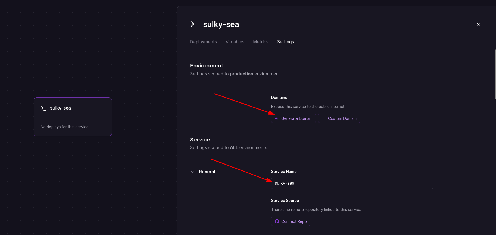
  2. Configurar as variaveis de ambiente:
    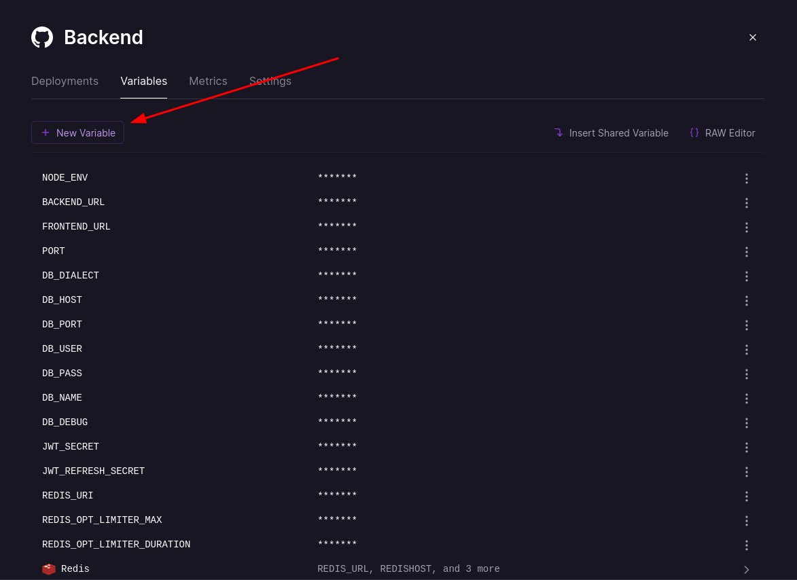
  3. Vincular o projeto ao repositório do github:
    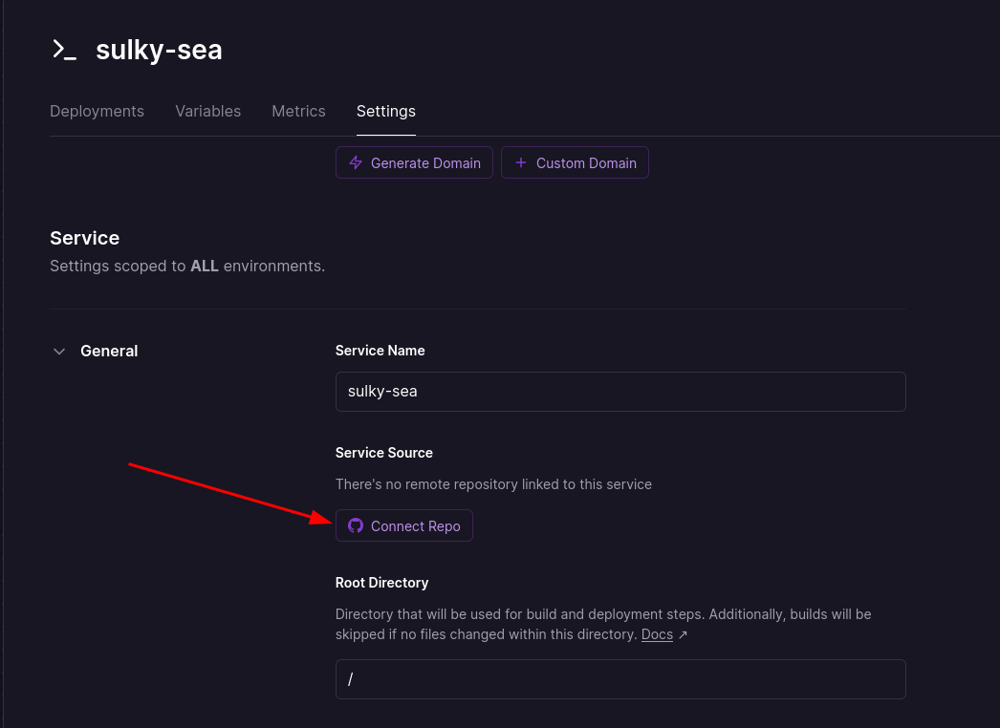

Depois que finalizar o vinculo, o deploy vai iniciar e logo mais a aplicação estará online

### 7. Caso queira colocar uma url customizavel no backend, basta seguir com a configuração

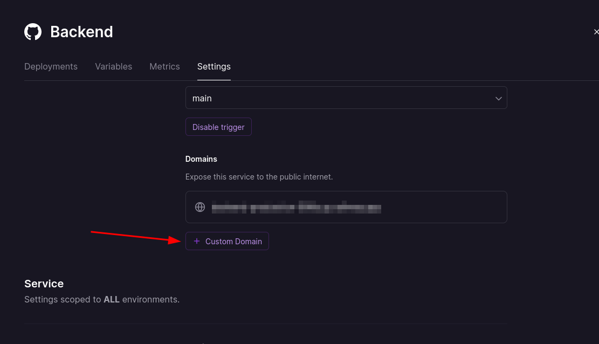

---

>- Para já ter o usuário admin da Revoi, é preciso rodar a seed conforme a documentação da aplicação manda, apontando para o banco de dados criado, ou criar via supabase.

[vercel]: https://vercel.com
[railway]: https://railway.app
[supabase]: https://app.supabase.com
